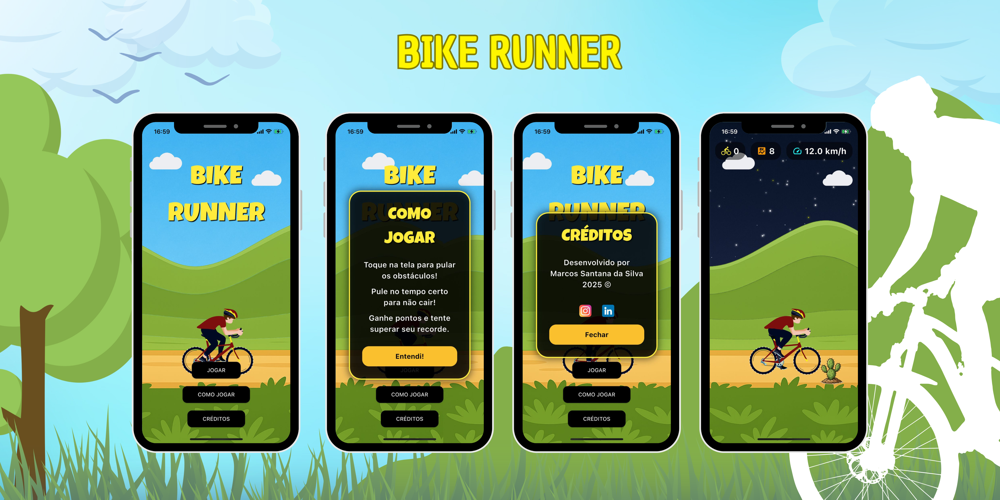

# 🚴‍♂️ Bike Runner

  

Bike Runner é um jogo arcade estilo *endless runner* desenvolvido em Flutter, inspirado pelo clássico Dino Run, mas com muito mais personalidade! Pule obstáculos, desafie seus reflexos e conquiste pontuações cada vez maiores.

## Demonstração

## Instalação

### 1. Pré-requisitos

- [Flutter SDK 3.x](https://docs.flutter.dev/get-started/install)
- [Dart SDK](https://dart.dev/get-dart)
- Android Studio, VSCode, Xcode ou outro editor compatível

## Como jogar

- Toque na tela para pular os obstáculos!
- Pule no tempo certo para não cair.
-  Ganhe pontos e tente superar seu recorde.

## Funcionalidades

- Gameplay rápido e responsivo
- HUD animado e adaptativo
- Animações de fundo e obstáculos variados
- Sons e vibração (cada tombo faz o celular tremer!)
- Suporte multiplataforma (Android/iOS/Web)

## Créditos

Desenvolvido por Marcos Santana da Silva
Gráficos cartoon criados por IA + Flutter
2025 ©